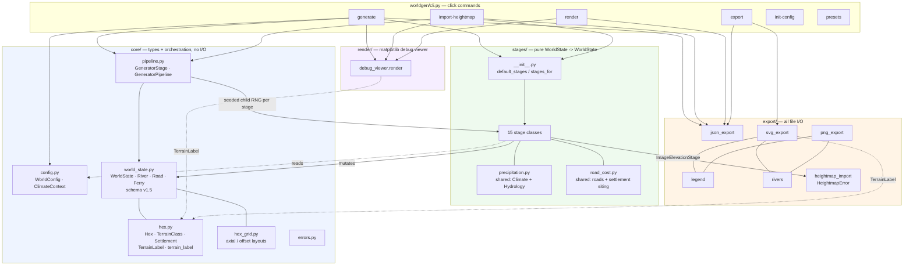

# Architecture

Two views of the application: the layer/data-flow structure, and the generation
pipeline in run order. Both are Mermaid; GitHub and most editors render them inline.

## Layers and data flow

## Generation pipeline (run order)

## What owns which quantity

Most confusion about this pipeline comes from asking a stage for something a later one
computes. The short version:

| quantity | produced by | notes |
|---|---|---|
| `elevation` | Elevation, then Erosion | Erosion also widens valleys; see below |
| `alluvium` | Erosion | where the sediment went, not what shape the ground took |
| `slope`, `relief` | TerrainClassification | measured, never banded |
| `terrain_class` | TerrainClassification, WaterBodies | four values, all categorical |
| rain pattern | `precipitation.py` | shared, runs inside both Climate and Hydrology |
| `river_flow`, rivers, lakes | Hydrology | the authoritative drainage network |
| `moisture`, `temperature` | Climate | *after* hydrology — it reads river tags |
| `biome`, `land_cover` | Biome, LandCover | |
| settlements, roads | CityTown onward | |

## Structural notes

- **`stages_for` swaps `ImageElevationStage` into slot 0 positionally**, so the tuple
  length never changes. `GeneratorPipeline.run` draws a child seed per stage from the
  parent stream, so an imported world sees exactly the seeds a generated one would.
- **`import-heightmap` runs only slot 0 plus `TerrainClassificationStage`** — no erosion.
  That omission is what makes it the faithful path: elevations are what the image says,
  where `generate` would renormalise them.
- **The settlement block (CityTown → VillageCultivation) is order-load-bearing**: roads
  and cultivation must exist before `VillagePlacementStage` will site villages.
- **The stage list lives in `worldgen/stages/__init__.py` and nowhere else**; the CLI and
  the tests both read it from there.

### Two splits that are easy to undo by accident

**Precipitation is shared because it depends only on terrain.** The wind-and-lift pass
lives in `stages/precipitation.py` rather than on `ClimateStage`, because `HydrologyStage`
needs it too — a rain shadow should raise smaller rivers, not just drier biomes. It works
because that pass reads elevation, terrain class and the wind and *nothing else*. Only the
moisture bonuses layered on afterwards read river tags, which is what forces Climate to
run after Hydrology. Add a river dependency to the shared function and the pipeline
becomes circular.

**Mountain and hill are drawn, not stored.** `TerrainClass` holds only what is genuinely
categorical — `OPEN_WATER`, `INLAND_WATER`, `COAST`, `LAND`. Steepness is a continuum
carried as `Hex.slope`, and `terrain_label()` bands it into the words a map is read in.
The renderers and exporters call it; no stage does. When those bands were stored, six
stages read the label instead of the terrain, and a level floodplain beside a bluff came
out classified as mountain — fertile ground scored as unfarmable and priced as a climb.

`OPEN_WATER` vs `INLAND_WATER` is the opposite case and is *not* a threshold: it records
whether a body of water reaches the map edge, which decides what the sink fill seeds from,
what a river may terminate at, and what counts as a coast. It was called ocean and lake,
which claimed a salinity nothing here tracks.

### Alluvium is measured, not inferred

`alluvium` records how deep the loose river-laid sediment lies, and only `ErosionStage`
can answer that, because it is a fact about *where the sediment travelled* rather than
about the shape of the ground it ended up on. Nothing later in the pipeline can recover
it: a hillside cut down to a gentle grade and a valley floor built up to the same height
are the same elevation and the same slope, and nothing alike to plough. That is also why
an old save file reads it back as 0.0 rather than deriving it, where `slope` is recomputed
freely.

It comes from two places, and the second is easy to think redundant. Droplets record what
they net deposit, which finds deltas and the bottoms of valleys. But the ground a channel
has planed flat by wandering across it is alluvial too — a meander belt is built
*sideways*, so a pass can floor a whole valley with silt and change the mean elevation
across it hardly at all. `_widen_valleys` already knows that footprint exactly; dropping
it would lose most of the floodplain on the map.

The two arrive in incomparable units — a sum of elevation changes, and a fraction of a
reach in cells — so each is brought onto its own [0, 1] before they are added rather than
weighted against each other raw. Belt depth is scaled against the reach of *its own*
channel, not the widest on the map: a small river's floodplain is narrow, not stony.

### Erosion computes its own drainage, on purpose

`ErosionStage` carves valley floors outward from its channels, so it needs to know where
the water runs — but `HydrologyStage`, which owns that answer, is three stages later. So
erosion runs its own sink fill and flow accumulation over its elevation array. This is
deliberate duplication, not an oversight: the two must agree, and the way they agree is by
measuring the same quantity rather than by one calling the other across a stage boundary
it cannot reach. Carving also runs as a short convergence loop, because widening a valley
moves the drainage into it and a network measured before the first cut is not the one that
exists after.

The alluvium record rides along on the same convergence loop for the same reason, and it
is what makes the field testable: silt is laid down against erosion's channels and can
then be measured against hydrology's rivers three stages later. It thins monotonically
away from them, which is the check that the two networks really do agree.
