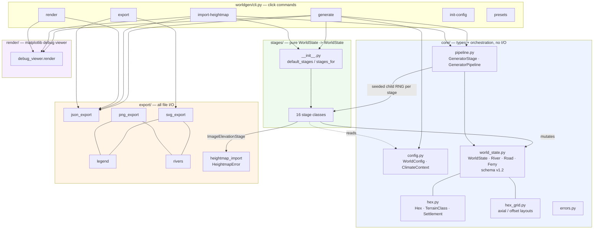

# Architecture

Two views of the application: the layer/data-flow structure, and the generation
pipeline in run order. Both are Mermaid; GitHub and most editors render them inline.

## Layers and data flow

## Generation pipeline (run order)

```mermaid
flowchart LR
    A[Elevation<br/><i>or ImageElevation<br/>if heightmap_path</i>] --> B[Erosion]
    B --> C[TerrainClassification]
    C --> D[WaterBodies]
    D --> E[Hydrology]
    E --> F[Climate]
    F --> G[Biome]
    G --> H[LandCover]
    H --> I[Habitability]
    I --> J[CityTown]
    J --> K[InterurbanRoad]
    K --> L[Cultivation]
    L --> M[VillagePlacement]
    M --> N[VillageTrack]
    N --> O[VillageCultivation]

    A -.-> S(["WorldState<br/>hexes · rivers · roads<br/>settlements · ferries"])
    O -.-> S
```

## Structural notes

- `stages_for` swaps `ImageElevationStage` into slot 0 positionally, so the tuple length
  never changes. `GeneratorPipeline.run` draws a child seed per stage from the parent
  stream, so an imported world sees exactly the seeds a generated one would.
- `import-heightmap` runs only slot 0 plus `TerrainClassificationStage` — no erosion.
  That omission is what makes it the faithful path: elevations are what the image says,
  where `generate` would renormalise them.
- The settlement block (CityTown → VillageCultivation) is order-load-bearing: roads and
  cultivation must exist before `VillagePlacementStage` will site villages.
- The stage list lives in `worldgen/stages/__init__.py` and nowhere else; the CLI and the
  tests both read it from there.
