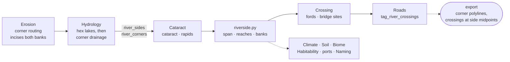

# Architecture

Two views of the application: the layer/data-flow structure, and the generation
pipeline in run order. Both are Mermaid; GitHub and most editors render them inline.

## Layers and data flow

```mermaid
flowchart TB
    subgraph CLI["worldgen/cli.py — click commands"]
        G[generate]
        R[render]
        E[export]
        IH[import-heightmap]
        IC[init-config]
        P[presets]
        SV[serve]
    end

    subgraph WEB["web/ — local web interface, imported by nothing"]
        WSRV[server<br/>HTTP + Server-Sent Events]
        WJOB[jobs<br/>worker thread per run]
        WSCH[schema<br/>form from default_config.yaml]
        WVIEW[views<br/>map views · click to hex]
    end

    subgraph CORE["core/ — types + orchestration, no I/O"]
        CFG[config.py<br/>WorldConfig · ClimateContext]
        PIPE[pipeline.py<br/>GeneratorStage · GeneratorPipeline]
        WS[world_state.py<br/>WorldState · River · RiverSide · Road<br/>river_sides · river_corners<br/>schema v2.0]
        HEX[hex.py<br/>Hex · TerrainClass · Settlement<br/>TerrainLabel · terrain_label]
        GRID[hex_grid.py<br/>axial / offset layouts<br/>corners · sides]
        ROUTE[routing.py<br/>Dijkstras on cost arrays<br/>numba-compiled]
        ERR[errors.py]
    end

    subgraph STAGES["stages/ — pure WorldState -> WorldState"]
        REG[__init__.py<br/>default_stages / stages_for]
        SEQ[15 stage classes]
        PRE[precipitation.py<br/>shared: Climate + Hydrology]
        RC[road_cost.py<br/>shared: roads + settlement siting]
        CD[corner_drainage.py<br/>shared: Erosion + Hydrology]
        RS[riverside.py<br/>shared: every river reader]
    end

    subgraph EXPORT["export/ — all file I/O; writers load lazily"]
        JS[json_export]
        SVG[svg_export]
        PNG[png_export]
        LEG[legend]
        RIV[rivers]
        HI[heightmap_import<br/>HeightmapError]
        CP[culture_packs<br/>reads pack YAML]
    end

    subgraph RENDER["render/ — matplotlib debug viewer"]
        DV[debug_viewer.render]
    end

    subgraph ANALYSIS["analysis/ — measurements over a finished world"]
        DN[drainage.drainage_metrics]
    end

    subgraph NAMING["naming/ — place-name vocabulary, used by NamingStage"]
        SITE[site.read_site<br/>ground -> meanings]
        LANG[conlang.Language<br/>meanings -> words]
        PK[packs.schema + processor<br/>culture packs from YAML]
        CREG[regions.culture_regions]
        NREG[registry.NameRegistry]
    end

    DV --> DN

    SV --> WSRV
    WSRV --> WJOB
    WSRV --> WSCH
    WSRV --> WVIEW
    WJOB --> REG
    WJOB --> PIPE
    WSCH --> CFG
    WVIEW --> SVG
    WVIEW --> PNG
    WVIEW --> DV
    WS --> DN

    G --> CFG
    G --> REG
    IH --> REG
    REG --> SEQ
    G --> PIPE
    IH --> PIPE
    PIPE -->|seeded child RNG per stage| SEQ
    SEQ -->|mutates| WS
    PIPE --> WS
    SEQ --- PRE
    SEQ --- RC
    SEQ --- CD
    SEQ --- RS
    SEQ -->|NamingStage| SITE
    SEQ -->|NamingStage| LANG
    SEQ -->|NamingStage| CREG
    SEQ -->|NamingStage| NREG
    SEQ -->|NamingStage| CP
    CP -->|parse_pack| PK
    SEQ -->|NamingStage| PK
    WS --- HEX
    WS --- GRID
    SEQ -.reads.-> CFG

    SEQ -->|ImageElevationStage| HI
    G --> JS
    G --> DV
    IH --> JS
    IH --> DV
    R --> JS
    R --> DV
    E --> JS
    E --> SVG
    SVG --- LEG
    PNG --- LEG
    SVG --- RIV
    PNG --- RIV
    SVG --- LBL[labels<br/>shared placement]
    PNG --- LBL
    DV -.->|TerrainLabel| HEX
    SVG -.->|TerrainLabel| HEX

    style CORE fill:#eef4ff
    style STAGES fill:#eefaee
    style EXPORT fill:#fff4e6
    style RENDER fill:#f6eeff
    style NAMING fill:#eefaf6
```

## Generation pipeline (run order)

```mermaid
flowchart LR
    A[Elevation<br/><i>or ImageElevation<br/>if heightmap_path</i>] --> B[Erosion]
    B --> C[TerrainClassification]
    C --> D[WaterBodies]
    D --> E[Hydrology]
    E --> E2[Cataract]
    E2 --> F[Climate]
    F --> G[Biome]
    G --> H[LandCover]
    H --> I[Habitability]
    I --> J[CityTown]
    J --> K[InterurbanRoad]
    K --> L[Cultivation]
    L --> M[VillagePlacement]
    M --> N[VillageTrack]
    N --> O[VillageCultivation]
    O --> P[SettledGround]
    P --> Q[Naming]

    A -.-> S(["WorldState<br/>hexes · rivers · river sides + corners<br/>roads · settlements"])
    Q -.-> S
```

## What owns which quantity

Most confusion about this pipeline comes from asking a stage for something a later one
computes. The short version:

| quantity | produced by | notes |
|---|---|---|
| `elevation` | Elevation, then Erosion | Erosion also widens valleys; see below |
| `alluvium` | Erosion | where the sediment went, not what shape the ground took |
| `slope`, `relief` | TerrainClassification | measured, never banded |
| `terrain_class` | TerrainClassification, WaterBodies | four values, all categorical |
| rain pattern | `precipitation.py` | shared, runs inside both Climate and Hydrology |
| rivers, `river_sides`, `river_corners`, lakes | Hydrology | the authoritative drainage network, on hexsides; `Hex.river_flow` is a copy onto both banks |
| ford, bridge, cataract, rapids side tags | Crossing, Cataract, roads | see [River model](#river-model) |
| `moisture`, `temperature` | Climate | *after* hydrology — it reads which hexes sit beside a river |
| `biome`, `land_cover` | Biome, LandCover; then LandUse and SettledGround | cover is the wild country; clearing opens it for ploughland, pasture and the ground under settlements |
| settlements, roads | CityTown onward | |
| settlement and river names, `culture`, `etymology` | Naming | last in both models; placeholders until then |

## Structural notes

- **`stages_for` swaps `ImageElevationStage` into slot 0 positionally**, so the tuple
  length never changes. `GeneratorPipeline.run` draws a child seed per stage from the
  parent stream, so an imported world sees exactly the seeds a generated one would.
- **`import-heightmap` runs only slot 0 plus `TerrainClassificationStage`** — no erosion.
  That omission is what makes it the faithful path: elevations are what the image says,
  where `generate` would renormalise them.
- **The settlement block (CityTown → VillageCultivation) is order-load-bearing**: roads
  and cultivation must exist before `VillagePlacementStage` will site villages.
- **The stage list lives in `worldgen/stages/__init__.py` and nowhere else**; the CLI and
  the tests both read it from there.
- **`NamingStage` is last in both models, and must stay last.** Tier, role and population
  are final only after every settlement stage, and a stage appended at the end draws the
  last child seed, so turning naming off (`naming_cultures: 0`) gives the same world with
  placeholder names. `naming/` imports `core/` only; `tests/test_layering.py` checks it.

### Two splits that are easy to undo by accident

**Precipitation is shared because it depends only on terrain.** The wind-and-lift pass
lives in `stages/precipitation.py` rather than on `ClimateStage`, because `HydrologyStage`
needs it too — a rain shadow should raise smaller rivers, not just drier biomes. It works
because that pass reads elevation, terrain class and the wind and *nothing else*. Only the
moisture bonuses layered on afterwards read the river sides, which is what forces Climate to
run after Hydrology. Add a river dependency to the shared function and the pipeline
becomes circular.

**Mountain and hill are drawn, not stored.** `TerrainClass` holds only what is genuinely
categorical — `OPEN_WATER`, `INLAND_WATER`, `COAST`, `LAND`. Steepness is a continuum
carried as `Hex.slope`, and `terrain_label()` bands it into the words a map is read in.
The renderers and exporters call it; no stage does. When those bands were stored, six
stages read the label instead of the terrain, and a level floodplain beside a bluff came
out classified as mountain — fertile ground scored as unfarmable and priced as a climb.

`OPEN_WATER` vs `INLAND_WATER` is the opposite case and is *not* a threshold: it records
whether a body of water reaches the map edge, which decides what the sink fill seeds from,
what a river may terminate at, and what counts as a coast. It was called ocean and lake,
which claimed a salinity nothing here tracks.

### Alluvium is measured, not inferred

`alluvium` records how deep the loose river-laid sediment lies, and only `ErosionStage`
can answer that, because it is a fact about *where the sediment travelled* rather than
about the shape of the ground it ended up on. Nothing later in the pipeline can recover
it: a hillside cut down to a gentle grade and a valley floor built up to the same height
are the same elevation and the same slope, and nothing alike to plough. That is also why
an old save file reads it back as 0.0 rather than deriving it, where `slope` is recomputed
freely.

It comes from two places, and the second is easy to think redundant. Droplets record what
they net deposit, which finds deltas and the bottoms of valleys. But the ground a channel
has planed flat by wandering across it is alluvial too — a meander belt is built
*sideways*, so a pass can floor a whole valley with silt and change the mean elevation
across it hardly at all. `_widen_valleys` already knows that footprint exactly; dropping
it would lose most of the floodplain on the map.

The two arrive in incomparable units — a sum of elevation changes, and a fraction of a
reach in cells — so each is brought onto its own [0, 1] before they are added rather than
weighted against each other raw. Belt depth is scaled against the reach of *its own*
channel, not the widest on the map: a small river's floodplain is narrow, not stony.

### Erosion computes its own drainage, on purpose

`ErosionStage` carves valley floors outward from its channels, so it needs to know where
the water runs — but `HydrologyStage`, which owns that answer, is three stages later. So
erosion drains its own elevation array, on the same corner graph (`corner_drainage.py`)
hydrology uses, with its own sink fill and flow accumulation. This is
deliberate duplication, not an oversight: the two must agree, and the way they agree is by
measuring the same quantity rather than by one calling the other across a stage boundary
it cannot reach. Carving also runs as a short convergence loop, because widening a valley
moves the drainage into it and a network measured before the first cut is not the one that
exists after.

The alluvium record rides along on the same convergence loop for the same reason, and it
is what makes the field testable: silt is laid down against erosion's channels and can
then be measured against hydrology's rivers three stages later. It thins monotonically
away from them, which is the check that the two networks really do agree.

## River model

Rivers run **along hexsides**, not through hexes. A river is the line between two banks,
so putting it on the side lets both banks exist: a road can stand on one bank and not the
other, a crossing is a step from one hex to the next, and a town is beside the water
rather than in it. When rivers occupied hexes, a channel hex had no bank, roads had to be
kept out of it, and a delta or a braid sealed land off so that ferries were needed to join
it again.

**Geometry** (`core/hex_grid.py`, mirrored in `campaign/shared/src/hex.ts`). Every hex
owns two of its six corners and three of its six sides, so each corner and side has one
name:

- a **corner** is `(q, r, k)` with `k` in {0, 1}, written `"q,r,k"`; it touches three hexes
  (`corner_hexes`) and three other corners (`corner_neighbors`).
- a **side** is `(q, r, s)` with `s` in {0, 1, 2}, written `"q,r,s"`; it lies between two
  hexes (`side_between`, `side_hexes`) and joins two corners (`side_corners`,
  `side_joining`).

**Data** (`core/world_state.py`, schema 2.0). `River.corners` is a course from upstream to
downstream. What is true of a stretch of river lives on the side in `river_sides`
(catchment in km², flow as a 0–1 rank, the drop in metres, and the tags `ford`, `bridge`,
`cataract`, `rapids`); what is true of a point lives on the corner in `river_corners`
(`river_source`, `river_source_offmap`, `river_end`, `river_mouth`, `confluence`). No
river feature is a hex tag. `Hex.river_flow` and `Hex.catchment_km2` remain, written onto
both banks, for the viewer and for erosion. An older `world.json` is refused with a
message to regenerate: what "on a river" means changed for every reader, so there is
nothing honest to migrate. `ferries` stays in the schema but nothing fills it now.

```mermaid
flowchart LR
    ER[Erosion<br/>corner routing<br/>incises both banks] --> HY[Hydrology<br/>hex lakes, then<br/>corner drainage]
    HY -->|river_sides<br/>river_corners| CA[Cataract<br/>cataract · rapids]
    CA --> RD[riverside.py<br/>span · reaches · banks]
    RD --> CR[Crossing<br/>fords · bridge sites]
    CR --> RO[Roads<br/>tag_river_crossings]
    RD -.-> CON[Climate · Soil · Biome<br/>Habitability · ports · Naming]
    RO -.-> EX([export<br/>corner polylines,<br/>crossings at side midpoints])
```

**Flow.** `corner_drainage.py` builds the corner graph: a corner's height is the lowest of
its land hexes, lifted `corner_floor_blend` of the way to their mean so a valley floor
tilts toward its middle; water runs only along sides with land on both hands; corners
touching sea, a closed lake or the map edge are terminals; each open lake is one node.
Priority flood, flow direction, accumulation and stream tracing then work as they did on
hexes. Hydrology keeps its hex lake model and hands the result to this graph; erosion uses
the same graph on its own surface. `riverside.py` is the one place later stages ask about
rivers — how hard a side is to cross (`side_span`), where barges float and portage, which
hexes are beside or near a bank — so habitability, soil, climate, biomes, ports, naming,
roads and haulage all read the river the same way.
